<p align="center">
  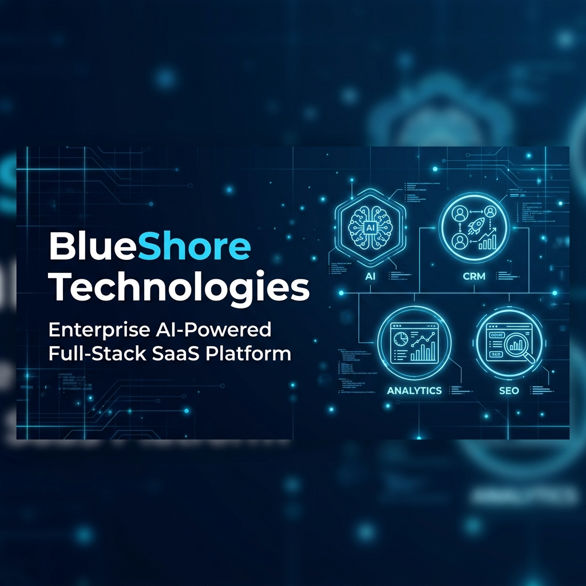
</p>

# BlueShore Technologies — Enterprise AI-Powered Full-Stack SaaS Platform

[](https://github.com/Yashv-22/BlueShore-Technologies/releases)
[](https://www.python.org/)
[](https://www.djangoproject.com/)
[](https://www.docker.com/)
[](https://www.postgresql.org/)
[](https://redis.io/)
[](https://github.com/Yashv-22/BlueShore-Technologies/actions)
[](LICENSE)
[](https://github.com/Yashv-22/BlueShore-Technologies/stargazers)
[](https://github.com/Yashv-22/BlueShore-Technologies/issues)
[](https://github.com/Yashv-22/BlueShore-Technologies/commits/main)

**BlueShore Technologies** is a production-grade, enterprise-ready full-stack SaaS platform designed for high-performance business automation, AI client interaction, real-time telemetry, lead management, and automated SEO publishing. 

Built on **Django 5.0**, **Django Channels**, **Redis**, **PostgreSQL**, **Celery**, **Nginx**, **Docker**, and **Google Gemini AI**, the platform offers a cohesive ecosystem connecting client-facing web applications with internal CRM operations, real-time analytics, and automated background workflows.

---

## 🌐 Live Demo & Quick Links

- **Live Website**: [https://www.blueshoretech.com](https://www.blueshoretech.com)
- **GitHub Repository**: [https://github.com/Yashv-22/BlueShore-Technologies](https://github.com/Yashv-22/BlueShore-Technologies)
- **Latest Release**: [Release v1.0.0](https://github.com/Yashv-22/BlueShore-Technologies/releases/tag/v1.0.0)

---

## 📑 Table of Contents

- [Why BlueShore?](#-why-blueshore)
- [Platform Overview](#-platform-overview)
- [Repository at a Glance](#-repository-at-a-glance)
- [Key Modules & Feature Matrix](#-key-modules--feature-matrix)
- [Feature Highlights](#-feature-highlights)
  - [Staff CRM & Sales Operations](#1-staff-crm--sales-operations)
  - [Google Gemini AI Chatbot](#2-google-gemini-ai-chatbot)
  - [Real-Time Visitor Telemetry](#3-real-time-visitor-telemetry)
  - [Programmatic SEO Engine](#4-programmatic-seo-engine)
  - [Blog CMS & Case Studies](#5-blog-cms--case-studies)
  - [Job Board & Malware-Scanned Resumes](#6-job-board--malware-scanned-resumes)
- [Platform Preview](#-platform-preview)
- [System Architecture](#-system-architecture)
- [Technology Stack](#-technology-stack)
- [REST API Overview](#-rest-api-overview)
- [Repository Structure](#-repository-structure)
- [Getting Started & Installation](#-getting-started--installation)
  - [Prerequisites](#prerequisites)
  - [Local Virtual Environment Setup](#local-virtual-environment-setup)
  - [Environment Variables Configuration](#environment-variables-configuration)
  - [Database Setup & Migrations](#database-setup--migrations)
  - [Running Tests & System Checks](#running-tests--system-checks)
  - [Development Server](#development-server)
- [Docker Production Deployment](#-docker-production-deployment)
- [Security Architecture](#-security-architecture)
- [Performance & Optimization](#-performance--optimization)
- [Project Roadmap](#-project-roadmap)
- [Documentation & Resources](#-documentation--resources)
- [Contributing](#-contributing)
- [License & Contact](#-license--contact)

---

## 🎯 Why BlueShore?

Modern technology businesses and growing digital agencies often rely on separate, fragmented software tools for CRM lead tracking, visitor analytics, customer engagement, SEO optimization, content management, and AI chatbot assistance. 

**BlueShore Technologies** unifies these critical business operations into a single, cohesive enterprise platform—reducing operational complexity while enabling intelligent client conversion, real-time analytics, and automated revenue pipeline management.

---

## 🔍 Platform Overview

BlueShore Technologies addresses the operational challenges of digital services providers by uniting client acquisition, intelligent lead conversion, real-time analytics, and backend management into a unified architecture.

Key capabilities include:
- **Intelligent Lead Conversion**: AI chatbots integrated directly with prompt guardrails and CRM ingestion pipelines.
- **Live Visitor Telemetry**: Low-latency WebSocket connections streaming real-time visitor behaviors, active pages, scroll depth, and geolocations.
- **Full Lead Lifecycle Management**: Visual Kanban board, automated proposal/contract generation, and client portals.
- **Automated Content Operations**: Programmatic location-based landing pages, dynamic XML sitemaps, and rich blog CMS.
- **Hardened Security**: Multi-tier defense with role-based access control (RBAC), 2FA TOTP authentication, rate limiting, brute-force blocking, and ClamAV virus scanning for file uploads.

---

## 📊 Repository at a Glance

| Metric | Value | Details |
|---|---|---|
| **Django Apps** | `10` | Modular packages (`core`, `crm`, `chatbot`, `intelligence`, `seo`, etc.) |
| **REST API Endpoints** | `20+` | Endpoints for Auth, CRM, AI Chatbot, Careers, Contact & Newsletter |
| **Architecture Diagrams** | `6` | System, Request Flow, AI, CRM, Database Schema & Security diagrams |
| **Platform Screenshots** | `7` | Interface previews of Homepage, Dashboard, CRM, Analytics, AI & SEO |
| **Docker Services** | `6` | Orchestrated containers (`web`, `db`, `redis`, `celery`, `clamav`, `nginx`) |
| **Automated Test Suite** | `48` | Unit tests passing cleanly (`python manage.py test`) |
| **CI Pipeline** | `GitHub Actions` | Automated checks & testing on push/PR (`ci.yml`) |
| **Production Status** | `Ready` | Containerized stack with non-root isolation and Nginx SSL proxy |

---

## ⚡ Key Modules & Feature Matrix

| Module | App Namespace | Status | Key Functionality |
|---|---|---|---|
| **Core Authentication** | `apps.core` | `Production` | User RBAC, 2FA TOTP, custom password policies, security headers middleware. |
| **Staff CRM** | `apps.crm` | `Production` | Lead tracking, Kanban pipeline, calendar events, proposal/contract/invoice PDF generation. |
| **AI Chatbot Rep** | `apps.chatbot` | `Production` | Google Gemini API integration, prompt guardrails, auto lead capture. |
| **Visitor Intelligence** | `apps.intelligence` | `Production` | WebSockets (Django Channels), live visitor map, active session tracking, scroll analytics. |
| **SEO & Landing Pages** | `apps.seo` | `Production` | Programmatic local landing pages, dynamic XML sitemaps, robots.txt management, meta tag injection. |
| **Blog & Case Studies** | `apps.blog` | `Production` | Rich article publishing, category tagging, author profiles, case study showcases. |
| **Careers & Resumes** | `apps.careers` | `Production` | Open position listings, applicant tracking system (ATS), ClamAV virus scanning on PDFs. |
| **Contact Ingestion** | `apps.contact` | `Production` | Inbound form processing, spam filtering, email notification dispatch via Celery. |
| **Portfolio Showcase** | `apps.portfolio` | `Production` | Client project gallery, interactive filters, tech stack tagging. |
| **Newsletter Engine** | `apps.newsletter` | `Production` | Subscriber management, double opt-in, automated welcome emails. |

---

## 💡 Feature Highlights

### 1. Staff CRM & Sales Operations
- **Interactive Kanban Pipeline**: Drag-and-drop status transitions across New, Contacted, Qualified, Proposal, Won, and Lost stages.
- **Document Engine**: Dynamic HTML-to-PDF rendering for proposals, contracts, and invoices.
- **Calendar & Scheduling**: Appointment tracking linked directly to client profiles.

### 2. Google Gemini AI Chatbot
- **Context-Aware Assistance**: Powered by Google Gemini API to respond intelligently to service inquiries.
- **Automated Lead Capture**: Converts user queries into structured CRM lead records during conversation.
- **Security & Privacy Guardrails**: Regex-based filtering to prevent prompt injection and API key leakage.

### 3. Real-Time Visitor Telemetry
- **WebSocket Streaming**: Built on Django Channels 4.1 and Daphne ASGI server.
- **Live Operations Cockpit**: Tracks concurrent active users, current URLs, time-on-page, and geographic origin.
- **Zero Database Bloat**: Ephemeral event caching powered by Redis pub/sub.

### 4. Programmatic SEO Engine
- **Scalable Geo-Targeting**: Generates location-tailored service pages dynamically from pillar templates.
- **Automated Sitemaps**: Dynamic XML sitemap generator supporting Google indexing rules.
- **Custom Meta Overlays**: Injects page-specific Open Graph and Twitter card tags without modifying templates.

### 5. Blog CMS & Case Studies
- **Rich Content Management**: Category organization, search filtering, and markdown rendering.
- **Author Attribution**: Profile links, social handles, and author bio sections.

### 6. Job Board & Malware-Scanned Resumes
- **Applicant Tracking**: Structured job postings with direct application submission.
- **ClamAV Integration**: Automatic background virus scanning of uploaded resume files before storage.

---

## 📸 Platform Preview

> [!TIP]
> **🎥 Product Demo Walkthrough**  
> Explore the live walkthrough of BlueShore Technologies in action—featuring real-time WebSockets telemetry, the Gemini AI Assistant, and the Staff CRM Kanban pipeline.

---

### 🌐 Homepage
The public-facing portal designed for conversion, showcasing core services, client success stories, and interactive consultation tools.

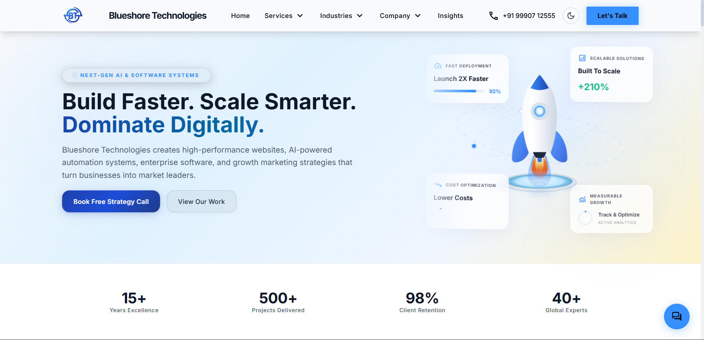

---

### 📊 Enterprise Dashboard
Centralized operational command center displaying CRM pipeline metrics, real-time telemetry, newsletter growth, and revenue analytics.

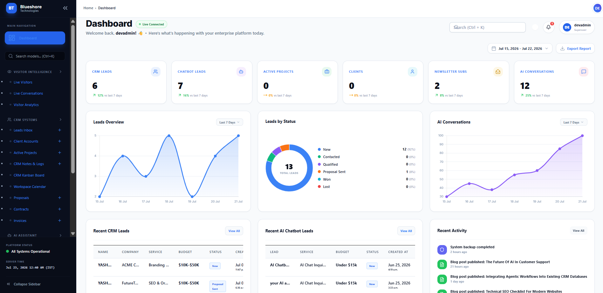

---

### 👥 CRM Management
Lead tracking, deal stage management, client contact records, and scheduling workflows.

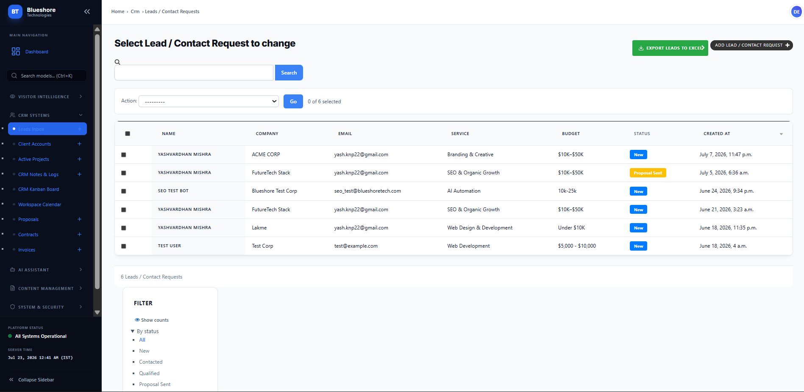

---

### 📈 Visitor Intelligence & Analytics
Real-time tracking of active visitor sessions, page navigation paths, and engagement metrics.

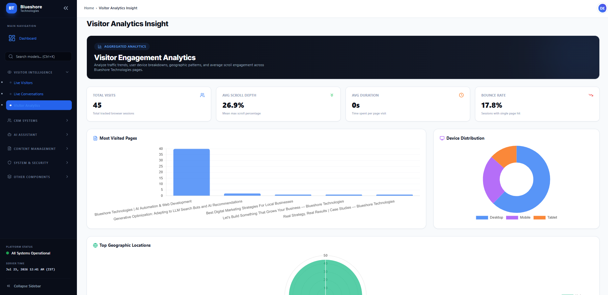

---

### 🤖 AI Assistant
Google Gemini powered conversational interface assisting prospects with instant service consultations and scheduling.

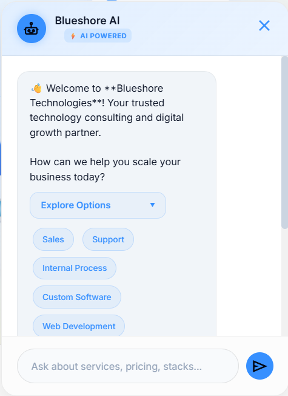

---

### 📝 Blog & Content Management
Content creation suite for publishing technical articles, industry insights, and client case studies.

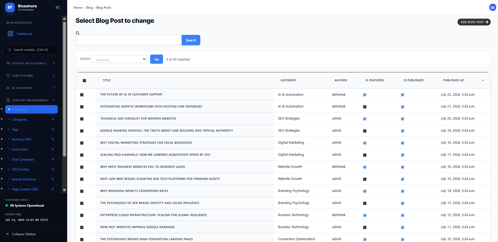

---

### 🚀 SEO Management
Admin overlay for controlling programmatic page metadata, target keywords, XML sitemaps, and indexing rules.

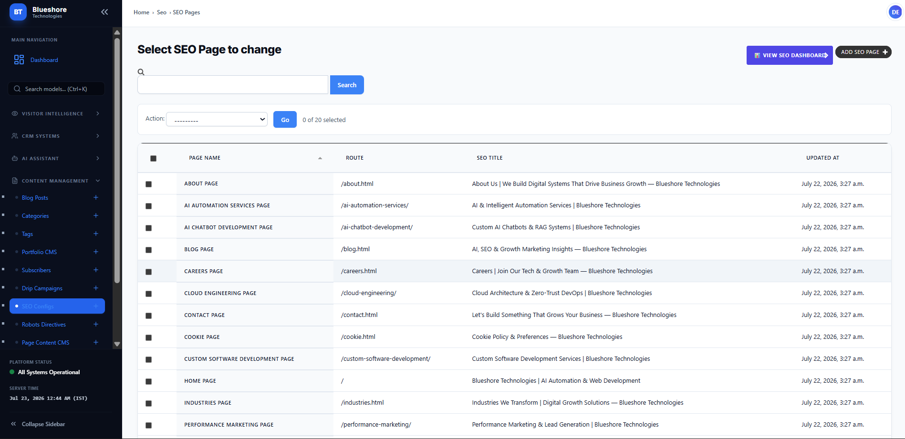

---

## 🏛 System Architecture

BlueShore Technologies is architected as a modular, decoupled application stack engineered for high availability and low latency.

### High-Level System Architecture
Overview of application layers, gateway entrypoints, async worker nodes, and persistence layers.

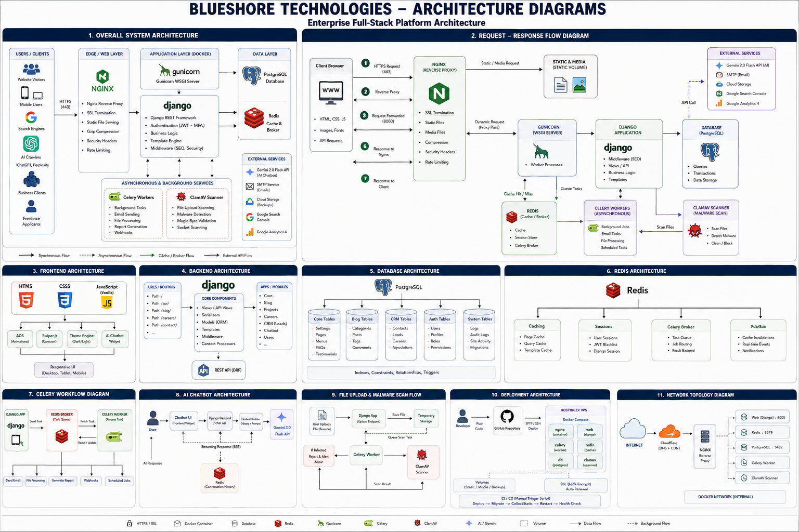

---

### Request Flow
Step-by-step path of HTTP and WebSocket requests through Nginx, Daphne/Gunicorn, Django apps, Redis, PostgreSQL, and background Celery workers.

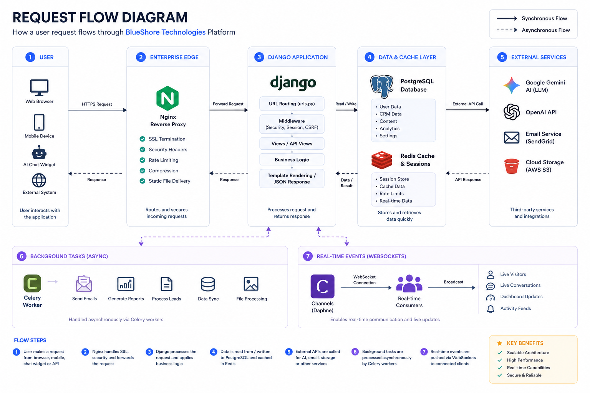

---

### AI Integration Architecture
Detailed view of how user prompts pass through validation guardrails, Google Gemini API, context providers, and CRM lead creation pipelines.

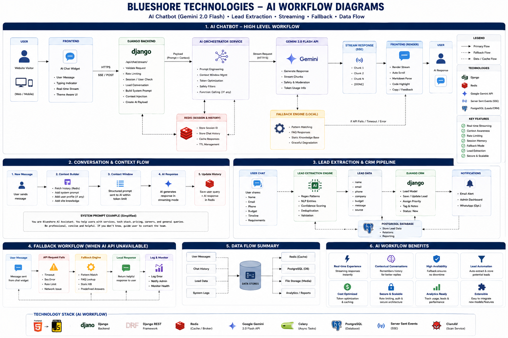

---

### CRM Workflow
Complete lifecycle of a client from initial contact form or AI chat to contract generation, project delivery, and invoicing.

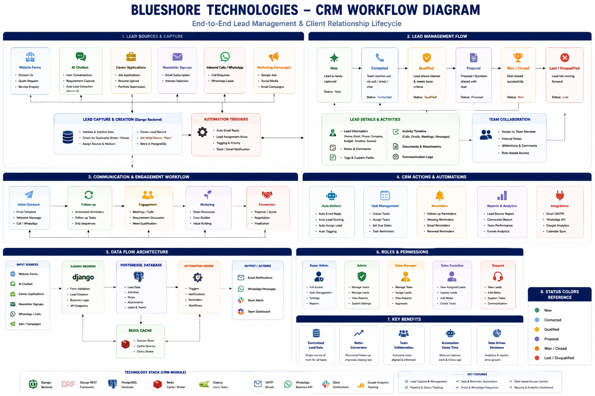

---

### Database Design & Schema ERD
Entity relationships linking core authentication, CRM entities, blog posts, portfolio submissions, and analytics records.

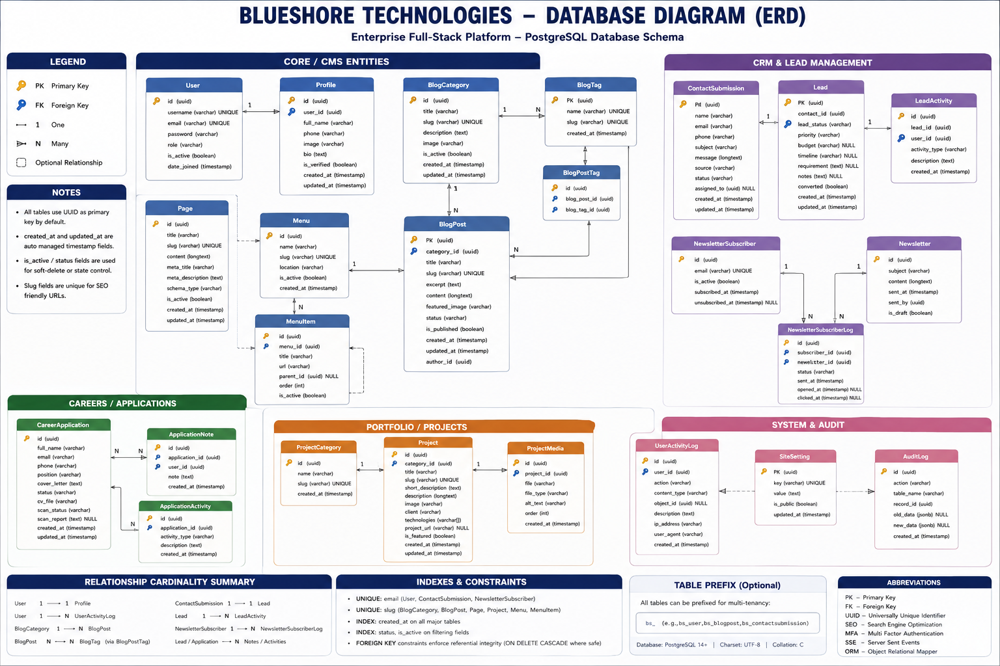

---

### Security & Defense Workflow
Multilayered request validation, token authentication, rate limiting, 2FA validation, and malware scanning flow.

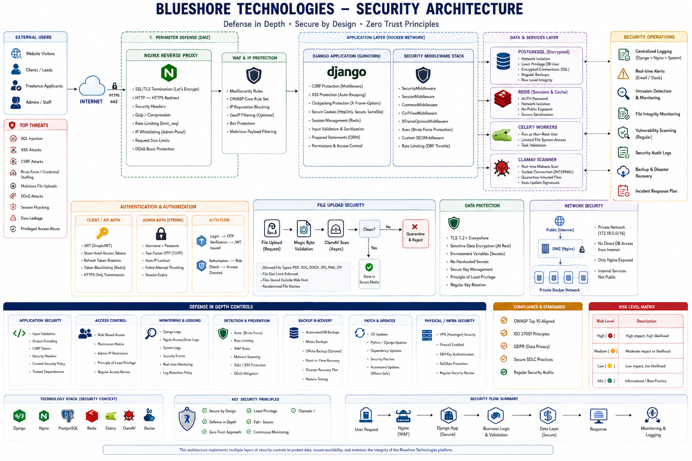

---

## 🛠 Technology Stack

```
                     ┌──────────────────────────────────────────┐
                     │          Client / Browser Tier           │
                     └────────────────────┬─────────────────────┘
                                          │
                     ┌────────────────────▼─────────────────────┐
                     │        Nginx Reverse Proxy / SSL         │
                     └──────────┬────────────────────┬──────────┘
                                │ (HTTP)             │ (WebSockets)
                     ┌──────────▼──────────┐ ┌───────▼──────────┐
                     │   Gunicorn WSGI     │ │   Daphne ASGI    │
                     └──────────┬──────────┘ └───────┬──────────┘
                                │                    │
                     ┌──────────▼────────────────────▼──────────┐
                     │          Django 5.0 Core Apps            │
                     └────┬──────────┬───────────┬───────────┬──┘
                          │          │           │           │
           ┌──────────────▼───┐  ┌───▼───────┐ ┌─▼─────────┐ ┌▼──────────┐
           │ PostgreSQL 15 DB │  │ Redis 7.0 │ │ Celery 5.4│ │ Google   │
           │                  │  │ Cache/Pub │ │ Workers   │ │ Gemini   │
           └──────────────────┘  └───────────┘ └───────────┘ └──────────┘
```

| Layer | Component | Technologies |
|---|---|---|
| **Backend Core** | Server Framework | Python 3.11, Django 5.0, Django REST Framework 3.15 |
| **Async & Real-time** | WebSockets & ASGI | Django Channels 4.1, Daphne 4.1, Redis Channel Layer |
| **Database Tier** | Primary RDBMS | PostgreSQL 15 (Production), SQLite3 (Local Dev Fallback) |
| **Cache & Task Queue** | Memory & Background | Redis 7.0, Celery 5.4 |
| **Artificial Intelligence**| AI Engine | Google Gemini API (`google-generativeai`) |
| **Security & Scanning** | File & Auth Security | ClamAV 1.0, Django-Axes 6.0, Django-OTP 1.3 |
| **Gateway & Hosting** | Web Server | Nginx (Alpine Linux), Gunicorn 22.0 |
| **Frontend UI** | Styling & Scripts | HTML5, Tailwind CSS 3, Vanilla JavaScript (ES6+), Material Symbols |

---

## 🔌 REST API Overview

The platform exposes structured RESTful API endpoints powered by **Django REST Framework** and authenticated via **JSON Web Tokens (JWT)** or **Session Authentication**.

### Authentication Headers
```http
Authorization: Bearer <jwt_access_token>
```

### Key API Endpoint Namespaces

| Namespace | Method | Description | Access Level |
|---|---|---|---|
| `/api/token/` | `POST` | Obtain JWT access and refresh token pair | Public |
| `/api/token/refresh/` | `POST` | Refresh expired JWT access token | Public |
| `/api/chatbot/chat/` | `POST` | Send message to AI Chatbot & capture lead | Public |
| `/api/crm/leads/` | `GET`, `POST` | List leads or ingest new lead | Staff / Authenticated |
| `/api/crm/leads/<id>/` | `PUT`, `DELETE` | Update lead status or details | Staff / Authenticated |
| `/api/contact/` | `POST` | Submit general contact form inquiry | Public (Throttled) |
| `/api/careers/apply/` | `POST` | Submit job application with resume PDF | Public (Throttled + ClamAV) |
| `/api/newsletter/subscribe/`| `POST` | Subscribe email address to newsletter | Public (Throttled) |

---

## 📁 Repository Structure

```
.
├── .github/                 # GitHub Actions CI Workflows & Issue Templates
│   ├── ISSUE_TEMPLATE/      # Bug report & feature request forms
│   ├── PULL_REQUEST_TEMPLATE.md
│   └── workflows/
│       └── ci.yml           # Automated CI pipeline
├── apps/                    # Modular Django Applications
│   ├── blog/                # Article publishing, case studies & author profiles
│   ├── careers/             # Job postings & malware-scanned resume processing
│   ├── chatbot/             # Google Gemini AI integration & prompt safety
│   ├── contact/             # Form submission processing & email dispatch
│   ├── core/                # Core authentication, RBAC, 2FA TOTP & security headers
│   ├── crm/                 # Staff dashboard, Kanban sales pipeline & PDF engines
│   ├── intelligence/        # WebSockets consumers for live telemetry
│   ├── newsletter/          # Email subscription management
│   ├── portfolio/           # Interactive project showcase
│   └── seo/                 # Programmatic landing pages & sitemaps
├── architecture/            # Architecture diagrams (.png format)
├── assets/                  # Frontend static CSS, JavaScript, hero banner & WebP images
├── blueshore_server/        # Django core settings, WSGI, ASGI & Celery configurations
├── docs/                    # Architectural & deployment manuals
│   ├── ARCHITECTURE.md      # Deep-dive system architecture document
│   └── DEPLOYMENT.md        # Production Docker & Nginx deployment guide
├── media/                   # Media uploads (authors, blog assets, uploads)
├── nginx/                   # Nginx reverse proxy configuration
│   └── default.conf         # Upstream proxy rules & static caching headers
├── private_tools/           # Private deployment & diagnostic scripts (git-ignored)
├── screenshots/             # Interface preview screenshots (.png format)
├── templates/               # Server-rendered HTML templates & admin UI
├── .env.example             # Template for environment configuration
├── .gitignore               # Production ignore rules for Python, Node, IDEs & secrets
├── CODE_OF_CONDUCT.md       # Contributor Code of Conduct
├── CONTRIBUTING.md          # Guidelines for contributing
├── Dockerfile               # Production multi-stage Docker build file
├── docker-compose.yml       # Production stack orchestration
├── HANDOVER.md              # Technical handover & developer manual
├── LICENSE                  # MIT Open Source License
├── manage.py                # Django CLI management script
├── PUBLIC_RELEASE_REPORT.md # Audit and release verification report
├── requirements.txt         # Python package dependencies
└── SECURITY.md              # Security & vulnerability disclosure policy
```

---

## 🚀 Getting Started & Installation

### Prerequisites

Ensure the following tools are installed on your local environment:
- **Python**: `3.11` or higher
- **Git**: `2.30` or higher
- **PostgreSQL**: `15+` (Optional for local development; SQLite fallback enabled by default)
- **Redis**: `7.0+` (Optional for local development; LocMem cache fallback enabled by default)
- **Docker & Docker Compose**: (Required for containerized setup)

---

### Local Virtual Environment Setup

1. **Clone the Repository**:
   ```bash
   git clone https://github.com/Yashv-22/BlueShore-Technologies.git
   cd BlueShore-Technologies
   ```

2. **Create Python Virtual Environment**:
   ```bash
   # On macOS/Linux
   python3 -m venv .venv
   source .venv/bin/activate

   # On Windows (PowerShell)
   python -m venv .venv
   .\.venv\Scripts\Activate.ps1
   ```

3. **Install Dependencies**:
   ```bash
   pip install --upgrade pip
   pip install -r requirements.txt
   ```

---

### Environment Variables Configuration

Copy `.env.example` to `.env` in the root directory:

```bash
cp .env.example .env
```

Key environment configuration parameters:

```ini
# Django Settings
DJANGO_SECRET_KEY=your-custom-production-secret-key-min-50-characters
DJANGO_DEBUG=True
DJANGO_ALLOWED_HOSTS=localhost,127.0.0.1

# Database Configuration (Set USE_POSTGRES=True to use PostgreSQL)
USE_POSTGRES=False
DB_NAME=blueshore_db
DB_USER=blueshore_admin
DB_PASSWORD=blueshore_secure_pass
DB_HOST=127.0.0.1
DB_PORT=5432

# Redis & Cache (Set USE_REDIS=True to use Redis)
USE_REDIS=False
REDIS_URL=redis://127.0.0.1:6379/1
CELERY_BROKER_URL=redis://127.0.0.1:6379/0

# AI Services
GEMINI_API_KEY=your-google-gemini-api-key
OPENAI_API_KEY=your-openai-api-key
```

---

### Database Setup & Migrations

Execute initial database migrations to initialize app models and schemas:

```bash
python manage.py migrate
```

To create an administrative user with full access:

```bash
python manage.py createsuperuser
```

---

### Running Tests & System Checks

Run Django system diagnostic checks to ensure environment integrity:

```bash
python manage.py check
```

Run the complete test suite (all 48 unit tests):

```bash
python manage.py test
```

---

### Development Server

Start the local development server:

```bash
python manage.py runserver
```

Open your browser and navigate to `http://127.0.0.1:8000/`.

---

## 🐳 Docker Production Deployment

For full production execution matching cloud staging environments, launch the multi-container stack via Docker Compose:

```bash
# 1. Prepare production environment file
cp .env.example .env

# 2. Build and start services in detached mode
docker compose up -d --build

# 3. Monitor container health
docker compose ps

# 4. Tail application logs
docker compose logs -f web
```

### Services Launched in Docker Stack:
- `web`: Daphne ASGI application server on port 8000.
- `db`: PostgreSQL 15 Alpine database instance.
- `redis`: Redis 7 Alpine cache and event bus.
- `celery_worker`: Background task worker.
- `clamav`: Antivirus daemon for file scanning.
- `nginx`: Alpine Nginx reverse proxy exposed on ports 80 & 443.

---

## 🛡️ Security Architecture

Security is built directly into every tier of the BlueShore Technologies platform:

- **Role-Based Access Control (RBAC)**: Fine-grained staff permissions across CRM, AI, SEO, Operations, and Security SOC panels.
- **Two-Factor Authentication (2FA)**: TOTP integration via `django-otp` for administrative user logins.
- **Brute-Force Protection**: Integrated `django-axes` monitoring failed login attempts by IP and username.
- **CSRF & Security Headers**: Strict CSRF token validation, X-Frame-Options (`DENY`), Content-Type-Options (`nosniff`), and HSTS support via `SecurityHeadersMiddleware`.
- **Malware Prevention**: Automatic ClamAV socket scanning on all submitted candidate resume attachments (`apps/careers`).
- **Container Isolation**: Non-root `django` user isolation in Docker runtime images.
- **Rate Limiting**: DRF API throttling on public form submissions and AI endpoints.

---

## ⚡ Performance & Optimization

- **Multi-Level Caching**: Redis-backed cache layer with local memory fallback for high-frequency queries.
- **Async Event Bus**: Background execution via Celery for email dispatches and analytical telemetry processing.
- **Database Optimization**: Indexed foreign keys, select_related, and prefetch_related query optimizations to prevent N+1 queries.
- **Static Asset Delivery**: WebP compressed image assets and Nginx static file caching headers (`Cache-Control: public, max-age=31536000`).

---

## 🗺️ Project Roadmap

### Completed (Release v1.0.0)
- [x] Core Django 5.0 modular architecture & PostgreSQL schema.
- [x] Staff CRM with Kanban pipeline and dynamic PDF contract/invoice generation.
- [x] Real-time visitor telemetry via WebSockets and Django Channels.
- [x] Google Gemini AI Chatbot integration with prompt safety filters.
- [x] ClamAV malware scanning pipeline for resume uploads.
- [x] Programmatic SEO page generation and dynamic XML sitemaps.
- [x] Multi-stage Docker container build and Nginx reverse proxy.
- [x] CI/CD pipeline with GitHub Actions.

### In Progress
- [ ] Upgrade to `google.genai` SDK for next-gen Gemini models.
- [ ] Granular CRM reporting and email campaign analytics dashboard.

### Planned Features
- [ ] Multi-tenant organization support for SaaS white-labeling.
- [ ] Native mobile push notifications for staff CRM lead alerts.

---

## 📚 Documentation & Resources

- [Architecture Guide](docs/ARCHITECTURE.md) — Comprehensive explanation of system design, WebSockets, and AI workflows.
- [Deployment Guide](docs/DEPLOYMENT.md) — VPS hosting, Docker setup, and SSL certificate installation.
- [Technical Handover](HANDOVER.md) — Developer reference guide and operational instructions.
- [Security Policy](SECURITY.md) — Vulnerability reporting guidelines and security practices.
- [Contributing Guidelines](CONTRIBUTING.md) — Standards for code contributions, issues, and pull requests.
- [Code of Conduct](CODE_OF_CONDUCT.md) — Contributor Covenant standards.
- [Audit & Release Report](PUBLIC_RELEASE_REPORT.md) — Comprehensive audit report for public release v1.0.0.

---

## 🤝 Contributing

We welcome contributions from the community!

1. Fork the repository on GitHub.
2. Create a feature branch (`git checkout -b feature/amazing-feature`).
3. Commit your changes following conventional commit syntax (`git commit -m 'feat: add amazing feature'`).
4. Ensure all tests pass (`python manage.py test`).
5. Push to your branch (`git push origin feature/amazing-feature`).
6. Open a Pull Request using the repository [Pull Request Template](.github/PULL_REQUEST_TEMPLATE.md).

For detailed rules, please review [CONTRIBUTING.md](CONTRIBUTING.md).

---

<div align="center">

### **BlueShore Technologies**
*Enterprise AI-Powered Full-Stack SaaS Platform*

`Python` • `Django` • `PostgreSQL` • `Redis` • `Docker` • `Google Gemini AI`

If this repository helped you or inspired your work, **⭐ consider starring the project on GitHub!**

[MIT License](LICENSE) • [Website](https://www.blueshoretech.com) • [LinkedIn](https://www.linkedin.com/company/blueshore-technologies/) • [GitHub](https://github.com/Yashv-22/BlueShore-Technologies)

</div>